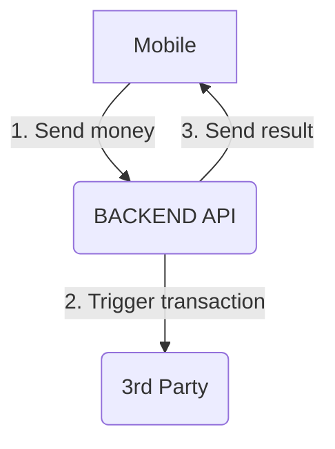

# Third-Party Integrated Transfer Management Project

This project is a demonstration application for managing transfers using a Laravel API. The API is called by a mobile application and communicates with a third-party service to perform transfers. The application showcases the management of asynchronous calls, webhooks, and a smooth user experience.


## Context



## Project Structure

```
.
├── docker-compose.yml
├── README.md
├── client
│   └── README.md
├── thirdpartymock
│   └── README.md
└── backend
    ├── README.md
    ├── Dockerfile
    ├── app
    │   ├── Http
    │   │   ├── Controllers
    │   │   |      │-Controller.php
    │   │   |      └── TransactionController.php
    |   ├── Jobs
    |   |   |── SendTransaction.php
    │   └── ...
    ├── ...
    ├── resources
    └── routes
    |    ├── ...
    |    └── web.php (BACKEND API ROUTES DEFINITION)
    |
    └── ...
```

The project is organized into three main folders:

1. `client`: Contains a simulated client application that calls the API to perform transfers.
2. `thirdparty`: Simulates a third-party service with specific behaviors, including delays and asynchronous responses.
3. `backend`: Contains the Laravel application, the API that manages transfers.

   
## Prerequisites

- Docker and Docker Compose are installed on your system.
- The application uses the SQLite database to simplify the demonstration.

## Installation and Launch

1. Clone this repository to your local machine: :

   ```bash
   git clone https://github.com/votre-utilisateur/votre-projet.git
   cd votre-projet

2. In the project's root folder, launch the Docker services with the following command:
   ```bash
   docker-compose up

2. **Queue Execution:** To monitor and manage background tasks, you need to manually run the Laravel queue. Open a terminal and execute:
   ```bash
   docker-compose exec backend php artisan queue:work


## Test Execution
If you want to perform some tests after your docker-compose is up, you can run the following cURL:

```
curl -H 'Content-Type: application/json' -X POST localhost:3100/transaction
```
or you can use [**Postman**](https://www.postman.com/) for API call testing

This will ask the client application to trigger a transaction creation. Which in turn will call your API.